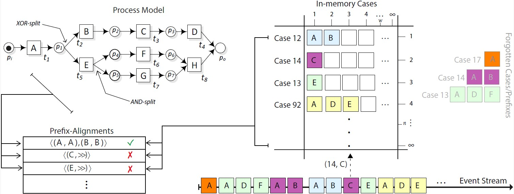

# Memory Efficient Online Conformance Checking

<p>
  <a href="https://dl.acm.org/doi/abs/10.1145/3477314.3507217"></a> 
   <a href="https://arxiv.org/abs/2112.13640"></a>
 
</p>


Implementation of:

- [Efficient Memory Utilization in Conformance Checking of Process Event Streams.](https://dl.acm.org/doi/abs/10.1145/3477314.3507217). R Zaman, M Hassani, BF van Dongen - SAC2022. ACM

- [A Framework for Efficient Memory Utilization in Online Conformance Checking](https://arxiv.org/abs/2112.13640). R Zaman, M Hassani, BF van Dongen - In arXiv.


This prototype implementation is related to the Memory-efficient prefix-alignments based Online Conformance Checking (OCC) approaches proposed in the abovementioned two papers. The proposed approach forgets states in excess of the defined limit.
However, the conformance checking can still be computed correctly for the future events, thereby reducing the memory foorprint of the online conformance checking system. 



This peotype implamantation requires a Petri net process model, its initial marking and final marking, and a state limit as input.

## Installation
 - Download the code to your local machine.
 - Run the "UITopia (MAOCC_States).launch". Let the code to download all the required ProM packages on the first run.
 - Load your event log and the reference process model in the displayed window and run the plugin "01 Compute Prefix Alignments - With Bounded States" with these inputs.
 - The next window requires as input the state limit.
 - The results are displayed on the console.


## Citation

If you use this code for your research, please consider citing our paper.

```bibtex
@inproceedings{zaman2022efficient,
  title={Efficient memory utilization in conformance checking of process event streams},
  author={Zaman, Rashid and Hassani, Marwan and Van Dongen, Boudewijn F},
  booktitle={Proceedings of the 37th ACM/SIGAPP SAC},
  pages={437--440},
  year={2022}
}


